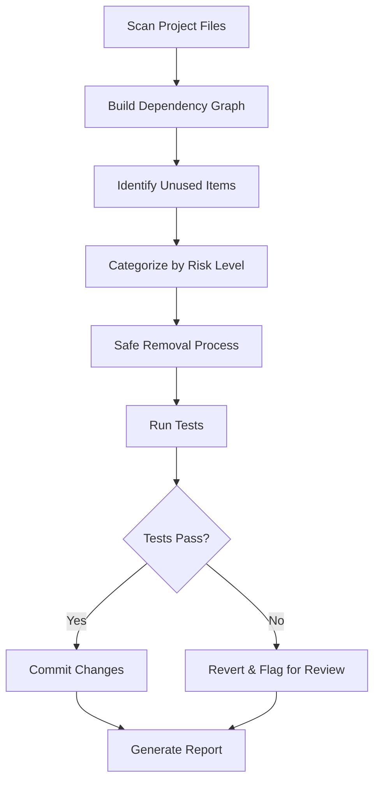

# Design Document

## Overview

The codebase cleanup system will systematically analyze the MadraXis React Native project to identify and safely remove unused files, dependencies, and code. The system will use static analysis techniques combined with runtime testing to ensure no functionality is broken during cleanup.

## Architecture

### Analysis Engine
The cleanup system will consist of several analysis modules:

1. **File Dependency Analyzer**: Maps import/export relationships across the codebase
2. **Package Dependency Analyzer**: Identifies unused npm dependencies
3. **Dead Code Analyzer**: Finds unused exports and unreachable code
4. **Safety Validator**: Ensures removals don't break functionality

### Processing Pipeline


## Components and Interfaces

### Core Interfaces

```typescript
interface UnusedItem {
  path: string;
  type: 'file' | 'dependency' | 'export' | 'code';
  reason: string;
  riskLevel: 'low' | 'medium' | 'high';
  usageContext?: string[];
}

interface CleanupReport {
  removed: UnusedItem[];
  flaggedForReview: UnusedItem[];
  errors: CleanupError[];
  summary: {
    filesRemoved: number;
    dependenciesRemoved: number;
    linesOfCodeReduced: number;
  };
}

interface AnalysisConfig {
  excludePatterns: string[];
  includeTestFiles: boolean;
  includeStoryFiles: boolean;
  safetyChecks: boolean;
}
```

### File Dependency Analyzer

**Purpose**: Build a complete dependency graph of the project
**Key Functions**:
- Parse TypeScript/JavaScript files for import/export statements
- Handle barrel exports (index.ts files)
- Track dynamic imports and require statements
- Account for asset imports (images, fonts, etc.)

**Implementation Strategy**:
- Use TypeScript compiler API for accurate parsing
- Build bidirectional dependency graph
- Handle React Native specific imports (@expo/vector-icons, react-native modules)
- Exclude configuration files from removal consideration

### Package Dependency Analyzer

**Purpose**: Identify unused npm dependencies
**Key Functions**:
- Parse package.json dependencies
- Cross-reference with actual imports in source code
- Handle transitive dependencies
- Account for build tool and configuration usage

**Special Considerations for React Native/Expo**:
- Expo SDK dependencies may be used implicitly
- React Native platform-specific imports
- Metro bundler configuration dependencies
- Testing framework dependencies

### Dead Code Analyzer

**Purpose**: Find unused exports and unreachable code
**Key Functions**:
- Identify exported functions/classes never imported
- Find unreachable code blocks
- Detect unused variables and parameters
- Handle re-exports and barrel files

**Analysis Scope**:
- Focus on `src/` directory for application code
- Exclude test files and stories from removal
- Consider component props and TypeScript interfaces
- Handle React component lifecycle methods

### Safety Validator

**Purpose**: Ensure safe removal without breaking functionality
**Key Functions**:
- Run test suite after each removal
- Validate build process still works
- Check for runtime dependencies
- Provide rollback mechanism

## Data Models

### Dependency Graph Structure
```typescript
interface DependencyNode {
  filePath: string;
  imports: string[];
  exports: string[];
  dependents: string[];
  dependencies: string[];
  isEntryPoint: boolean;
  fileType: 'component' | 'service' | 'utility' | 'type' | 'config';
}

interface ProjectGraph {
  nodes: Map<string, DependencyNode>;
  entryPoints: string[];
  orphanedFiles: string[];
}
```

### Risk Assessment Model
- **Low Risk**: Clearly unused files with no external references
- **Medium Risk**: Files used only in tests or stories
- **High Risk**: Files with potential runtime dependencies or dynamic imports

## Error Handling

### Analysis Errors
- **Parse Errors**: Skip files that can't be parsed, log for manual review
- **Circular Dependencies**: Handle gracefully, don't remove files in cycles
- **Dynamic Imports**: Flag for manual review rather than automatic removal

### Removal Errors
- **File System Errors**: Retry with proper permissions, log failures
- **Test Failures**: Immediate rollback and flagging
- **Build Failures**: Revert changes and mark as high-risk

### Recovery Mechanisms
- Git-based rollback for file removals
- Package.json backup before dependency removal
- Detailed logging for all operations

## Testing Strategy

### Unit Testing
- Test each analyzer module independently
- Mock file system operations
- Validate dependency graph construction
- Test risk assessment logic

### Integration Testing
- Test complete cleanup pipeline
- Validate rollback mechanisms
- Test with sample project structures
- Verify report generation

### Safety Testing
- Test with intentionally broken removals
- Validate test suite integration
- Test edge cases (circular deps, dynamic imports)
- Performance testing with large codebases

### Test Data Preparation
- Create sample unused files for testing
- Set up mock dependencies in package.json
- Prepare test cases with various risk levels
- Include React Native/Expo specific scenarios

## Implementation Considerations

### React Native/Expo Specific Handling
- **Metro Bundler**: Understand asset resolution
- **Expo Router**: Handle file-based routing dependencies
- **Platform Files**: Handle .ios.ts/.android.ts extensions
- **Native Modules**: Don't remove platform-specific dependencies

### Performance Optimization
- Incremental analysis for large codebases
- Parallel processing where possible
- Caching of dependency graphs
- Progress reporting for long operations

### Configuration Management
- Allow customization of exclusion patterns
- Configurable risk thresholds
- Option to dry-run without actual removal
- Integration with existing linting rules