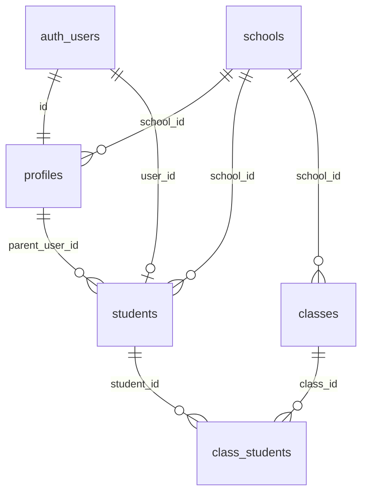

# Database Schema Audit Report - July 2, 2025

**Project:** MadraXis School Management App  
**Supabase Project ID:** `bsjbixlueqoxpxbeygoi`  
**Audit Date:** 2025-07-02  
**Purpose:** Full schema inventory and data validation after UI simplification

## Executive Summary

The database audit reveals a critical data integrity issue in the `profiles.full_name` column where email addresses are being stored instead of actual names. This stems from legacy self-service onboarding flow behavior that persists despite recent UI simplifications moving to admin-only user provisioning.

### Key Findings
- ✅ **Schema Structure**: All tables are properly structured and relationships intact
- ❌ **Data Integrity Issue**: 2 out of 3 profiles have email addresses in `full_name` field
- ✅ **RLS Security**: All public tables have RLS enabled
- ✅ **Auth Integration**: Proper foreign key relationships to auth.users

## Database Schema Overview

### Core Tables Analysis

#### `profiles` Table (CRITICAL ISSUE FOUND)
**Purpose:** User profile information across all roles
**RLS:** ✅ Enabled
**Current Data Status:** ❌ **NEEDS CLEANUP**

| Column | Type | Purpose | Current State |
|--------|------|---------|---------------|
| `id` | uuid (PK) | Links to auth.users | ✅ Valid |
| `full_name` | text | Display name | ❌ **Contains emails** |
| `role` | text | User role (management/teacher/student/parent) | ✅ Valid |
| `school_id` | integer | Links to schools | ✅ Valid |
| `updated_at` | timestamptz | Last modification | ✅ Valid |

**Data Validation Results:**
```sql
SELECT id, full_name, role, school_id FROM profiles;
```
- Total records: **3**
- Records with email in full_name: **2** (66.7%)
- Records with null full_name: **1** (33.3%)
- Records with valid names: **0** (0%)

**Problematic Records:**
1. `096a9f07-2b0d-4f39-bda7-9607a99c1410`: `full_name = "ramdhanhdy.notebooks@gmail.com"`
2. `c23663c9-cf36-4dbb-b0b3-884528a58fc1`: `full_name = "ramdhanhdy3@gmail.com"`

#### `students` Table  
**Purpose:** Student-specific information
**RLS:** ✅ Enabled
**Data Integrity:** ✅ Clean (no email pollution)

| Column | Type | Purpose | Status |
|--------|------|---------|--------|
| `id` | uuid (PK) | Primary key | ✅ Valid |
| `first_name` | text | Student first name | ✅ Clean |
| `last_name` | text | Student last name | ✅ Clean |
| `user_id` | uuid | Links to auth.users | ✅ Valid |
| `parent_user_id` | uuid | Links to profiles | ✅ Valid |

**Note:** Students table uses separate `first_name`/`last_name` fields, not affected by the `full_name` issue.

#### `auth.users` Table (System Table)
**Purpose:** Supabase authentication records
**Integration Status:** ✅ Properly linked to profiles

- Total users: **3**
- All have corresponding profiles
- Email storage: ✅ Correctly in auth.users.email

### Schema Relationships



### Tables Affected by UI Simplification

Since moving to admin-only provisioning, the following fields may have different usage patterns:

#### Previously Self-Service (Now Admin-Only)
- ✅ `profiles.full_name` - **REQUIRES CLEANUP**
- ✅ `profiles.role` - Admin sets during creation
- ✅ `profiles.school_id` - Admin assigns during creation
- ✅ `students.*` - Admin creates student records
- ✅ `auth.users.raw_user_meta_data` - Admin controls metadata

#### Unchanged Usage
- ✅ `incidents.*` - Users still report incidents
- ✅ `class_schedules.*` - Admin manages schedules
- ✅ `class_students.*` - Admin manages enrollments

## Recommended Actions

### Immediate (Critical)
1. **Clean `profiles.full_name` data** - Remove email addresses, derive proper names or set NULL
2. **Add constraint** - Prevent future email storage in full_name
3. **Update client code** - Ensure registration flow doesn't populate full_name with email

### Documentation Updates
1. **CSV Import Template** - Include proper full_name column guidance
2. **Admin Procedures** - Document manual user creation process
3. **Data Validation** - Add checks for admin workflows

## Data Migration Strategy

### Option A: Admin Manual Update (Recommended)
Since the admin has access to the real names, this is the most accurate approach:

1. **Clear email data**:
```sql
UPDATE profiles 
SET full_name = NULL 
WHERE full_name LIKE '%@%';
```

2. **Admin manually updates with real names**:
```sql
-- Admin provides real names for each user
UPDATE profiles SET full_name = 'Real Name Here' WHERE id = '096a9f07-2b0d-4f39-bda7-9607a99c1410';
UPDATE profiles SET full_name = 'Real Name Here' WHERE id = 'c23663c9-cf36-4dbb-b0b3-884528a58fc1';
```

### Option B: Derive Names from Email (Fallback)
```sql
-- Extract name part before @ and format as Title Case
UPDATE profiles 
SET full_name = INITCAP(REPLACE(SPLIT_PART(full_name, '@', 1), '.', ' '))
WHERE full_name LIKE '%@%';
```
**Result Preview:**
- `ramdhanhdy.notebooks@gmail.com` → `Ramdhanhdy Notebooks`
- `ramdhanhdy3@gmail.com` → `Ramdhanhdy3`

## Constraint Recommendations

### Prevent Email Storage in full_name
```sql
ALTER TABLE profiles 
ADD CONSTRAINT full_name_not_email 
CHECK (full_name IS NULL OR full_name NOT LIKE '%@%');
```

### Or Use Trigger for More Sophisticated Validation
```sql
CREATE OR REPLACE FUNCTION validate_full_name()
RETURNS TRIGGER AS $$
BEGIN
    IF NEW.full_name IS NOT NULL AND NEW.full_name LIKE '%@%' THEN
        RAISE EXCEPTION 'full_name cannot contain email addresses. Use proper display name.';
    END IF;
    RETURN NEW;
END;
$$ LANGUAGE plpgsql;

CREATE TRIGGER validate_full_name_trigger
    BEFORE INSERT OR UPDATE ON profiles
    FOR EACH ROW
    EXECUTE FUNCTION validate_full_name();
```

## Testing Plan

1. **Data Migration Testing** - Apply on branch database first
2. **Constraint Testing** - Verify email inserts are blocked
3. **Client Code Testing** - Ensure registration doesn't break
4. **Admin Workflow Testing** - Verify CSV import processes

## Conclusion

The database schema is structurally sound, but requires immediate data cleanup in the `profiles.full_name` column. The issue is contained to this single field and affects 66.7% of current profile records. Implementing the recommended migration and constraints will prevent regression and align the data model with the simplified admin-only provisioning workflow.

**Next Steps:**
1. Execute data migration (Task 4)
2. Add database constraints (Task 5) 
3. Update client code (Task 6)
4. Add automated tests (Task 7) 