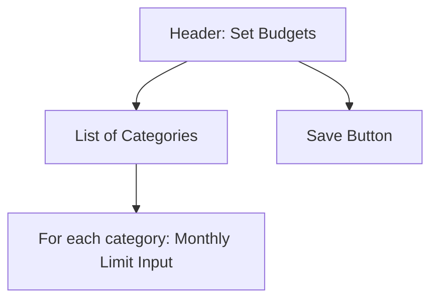
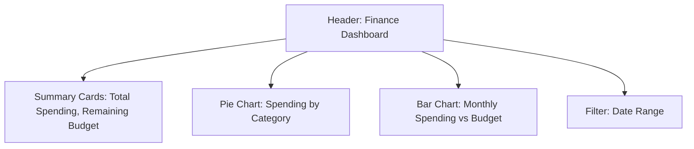

# Financial Management System Design

## High-Level Architecture

The system will be built on the existing MadraXis architecture:
- **Frontend**: React Native with Expo, using the consistent design system for UI components.
- **Backend**: Supabase for authentication, database, and real-time features.
- **Database**: PostgreSQL via Supabase, with new tables for financial data.
- **Integration**: Extend the management dashboard with new tabs/screens for finance. Use existing AuthContext for role-based access.

Data flow:
- Management users log expenses manually via forms.
- Budgets are set per category/month.
- Dashboards query aggregated data for visualizations.

## Database Schema

New tables:

- **expense_categories**:
  - id (uuid, primary key)
  - name (string, e.g., 'salaries', 'supplies', 'utilities')
  - school_id (uuid, foreign key to schools)
  - created_at (timestamp)

- **expenses**:
  - id (uuid, primary key)
  - category_id (uuid, foreign key to expense_categories)
  - amount (decimal)
  - date (date)
  - description (text)
  - notes (text, optional)
  - attachment_url (string, optional for future uploads)
  - school_id (uuid, foreign key to schools)
  - created_by (uuid, foreign key to profiles)
  - created_at (timestamp)

- **budgets**:
  - id (uuid, primary key)
  - category_id (uuid, foreign key to expense_categories)
  - month (date, first day of month)
  - limit_amount (decimal)
  - school_id (uuid, foreign key to schools)
  - created_at (timestamp)

RLS Policies: Restrict access to management role and matching school_id.

## UI Wireframes

### Expense Entry Screen
```mermaid
graph TD
    A[Header: Add Expense] --> B[Form]
    B --> C[Category Dropdown]
    B --> D[Amount Input]
    B --> E[Date Picker]
    B --> F[Description Textarea]
    B --> G[Notes Textarea (optional)]
    B --> H[Submit Button]
```

### Budget Setup Screen


### Financial Dashboard


## Finance-Hub Mobile Experience Design

> **Goal**: A school manager can record an expense, adjust a budget, and see budget health in < 60 seconds, one-handed, on 4G Android.

### Single Screen Structure

```
┌─────────────────────────────────────────┐
│  Finance Hub  (tab in Management stack) │
│  ┌───────────────────────────────────┐ │
│  │ 🔍 Search / Filter chips          │ │
│  └───────────────────────────────────┘ │
│                                         │
│  ┌──────────── Budget Ring Card ──────┐ │
│  │  Supplies                          │ │
│  │  [$540 / $600]  • 90 % full       │ │
│  │  ➀ Animated radial progress       │ │
│  └───────────────────────────────────┘ │
│                                         │
│  Recent Expenses (latest 3)             │
│  ┌─────────────────────────────────┐   │
│  │ 2024-07-18  •  $75  •  Pens    │   │
│  └─────────────────────────────────┘   │
│                                         │
│  [ +  Floating Action Button ]          │
└─────────────────────────────────────────┘
```

- **FAB** opens **BottomSheetModal** with two tabs:
  1. Log Expense (default)
  2. Adjust Budget

### Log-Expense Bottom Sheet

| Field            | Default / Behaviour                                    |
|------------------|--------------------------------------------------------|
| Category         | Smart-select from description + searchable dropdown    |
| Amount           | Large numeric keypad, paste auto-detect                |
| Date             | Chips: Today / Yesterday / Calendar swipe              |
| Description      | Single-line, placeholder "Pens & A4 paper"             |
| Notes / Receipt  | Collapsible section: Camera (auto-compress ≤ 500 KB)   |

• **Zero-scroll form** – fits 5.5" screen with keyboard open.  
• **Primary CTA** sticky at bottom: "Save Expense" (disabled until amount > 0).

### Budget-Quick-Adjust Bottom Sheet

• List of categories with **slider** (-10% / +10%) and numeric input fallback.  
• **Save** commits instantly; ring animates live via optimistic update.

### Budget Health Micro-feedback

• **Radial Progress Ring**  
  – Green > 20% remaining  
  – Amber 5-20%  
  – Red ≤ 5% (subtle pulse every 2s)  

• **Micro-copy**:  
  "$60 left • 9 days until Aug 1"

### Gesture & Accessibility

• Swipe-left on expense row → "Duplicate" chip appears (recurring bills).  
• All touch targets ≥ 48 × 48 dp; FAB 16 dp above bottom nav for thumb reach.  
• Dynamic Type scaling tested up to 200%.

### Empty & Loading States

• **Empty**: illustration of empty wallet + "Log your first expense to light up the dashboard."  
• **Skeleton**: mirrors exact layout; shimmer animation 800ms.

### Offline / Sync

• Optimistic updates via React Query + Supabase realtime.  
• Failed writes queued to AsyncStorage; banner shows "3 expenses pending sync".

### Navigation & Deep-Link

Route: `/management/finance`  
Deep-link: `madx://schools/:id/finance?open=addExpense`

### Component & Asset Checklist

- `components/ProgressRing.tsx` (reused from DS)  
- `FormTemplate` + `BottomSheetModal` (DS)  
- Icons: `wallet-plus`, `trending-up`, `camera-outline`  
- Animation lib: `moti` for ring & sheet transitions.

### Security & RLS

- Policies already scoped to `management` role + `school_id`.  
- Additional check: `CHECK (amount > 0)`.

### 4-Day Build Milestones

| Day | Deliverable | Test Criteria |
|-----|-------------|---------------|
| 1   | Shell + sheet scaffold | Sheet opens < 500ms on Moto G |
| 2   | Insert path + ring anim | 20 dummy expenses, 60 fps |
| 3   | Offline + quick-adjust | Airplane-mode test, auto-sync |
| 4   | 5-user hallway | SUS ≥ 85, task ≤ 45s |

Design file: `figma.com/file/madx-finance-hub`  
Ready to hand-off.

## API Endpoints (Supabase Queries)

- **Create Expense**: Insert into expenses table.
- **Get Expenses**: Select from expenses with filters (date, category).
- **Set Budget**: Upsert into budgets table.
- **Get Budgets**: Select from budgets for current month.
- **Get Dashboard Data**: RPC function to aggregate sums by category, compare to budgets.

Real-time subscriptions for dashboard updates if needed.