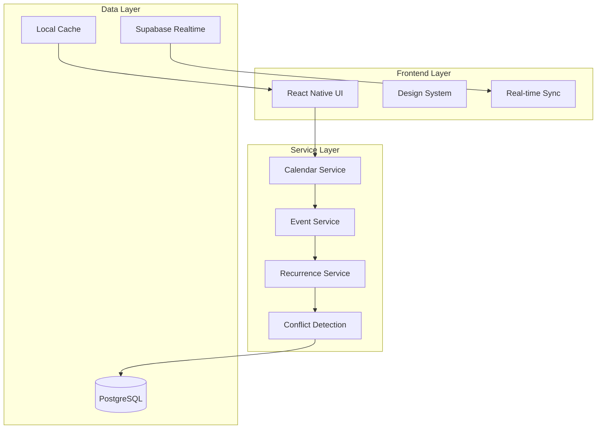

# Teacher-Centric Calendar Feature Specification

## Executive Summary

This specification defines a comprehensive teacher-centric calendar system for the MadraXis platform that enables teachers to create, view, edit, and delete class schedules with advanced features including recurring events, conflict detection, and real-time updates. The system builds upon the existing codebase architecture while introducing sophisticated calendar management capabilities tailored specifically for educational environments.

## Current System Analysis

### Existing Implementation
- **Basic Schedule Management**: Current system supports simple class schedules with day, time, and activity fields
- **Class-Subject Association**: Classes can have multiple subjects with basic scheduling
- **Teacher Authorization**: Role-based access control limiting teachers to their assigned classes
- **UI Components**: Existing design system with atomic components (Button, Typography, Card, etc.)
- **Database Schema**: PostgreSQL with Supabase, supporting class_schedules table

### Gaps Identified
- No recurring event support
- Limited conflict detection
- No real-time synchronization
- Basic calendar views only
- No bulk operations
- Limited mobile optimization

## Feature Requirements

### Core Functionality

#### 1. Calendar Views
- **Monthly View**: Grid-based calendar with event indicators
- **Weekly View**: Detailed 7-day schedule with time slots
- **Daily View**: Hour-by-hour breakdown for specific days
- **Agenda View**: List-based chronological view of upcoming events

#### 2. Event Management
- **Create Events**: Single and recurring class schedules
- **Edit Events**: Modify existing schedules with change tracking
- **Delete Events**: Soft delete with audit trail
- **Bulk Operations**: Multiple event selection and batch updates

#### 3. Recurring Events
- **Daily Recurrence**: Classes repeating every day
- **Weekly Recurrence**: Classes on specific days of the week
- **Monthly Recurrence**: Classes on specific dates or weekdays
- **Custom Patterns**: Complex recurrence rules (e.g., every other week)
- **Exception Handling**: Skip specific dates or modify individual occurrences

#### 4. Conflict Detection
- **Time Slot Conflicts**: Overlapping class schedules
- **Resource Conflicts**: Classroom/location double-booking
- **Teacher Availability**: Personal schedule conflicts
- **Student Conflicts**: Students enrolled in overlapping classes
- **Automatic Resolution**: Suggested alternative times

#### 5. Real-Time Updates
- **Live Synchronization**: Instant updates across all devices
- **Push Notifications**: Schedule changes and reminders
- **Collaborative Editing**: Multiple teachers can coordinate
- **Offline Support**: Sync when connection restored

### Advanced Features

#### 1. Smart Scheduling
- **Auto-scheduling**: AI-powered optimal time slot suggestions
- **Workload Balancing**: Distribute teaching load evenly
- **Student Preference**: Consider student availability patterns
- **Holiday Integration**: Automatic adjustment for school holidays

#### 2. Resource Management
- **Room Booking**: Integrated classroom reservation system
- **Equipment Allocation**: Track and reserve teaching resources
- **Capacity Management**: Monitor class size limits
- **Substitution System**: Handle teacher absences

#### 3. Analytics & Reporting
- **Schedule Analytics**: Usage patterns and optimization insights
- **Attendance Correlation**: Schedule impact on student attendance
- **Performance Metrics**: Teaching effectiveness by time slot
- **Export Capabilities**: PDF calendars and Excel reports

## Architecture Design

### System Architecture



### Component Architecture

```
src/
├── components/
│   ├── atoms/
│   │   ├── CalendarDay/
│   │   ├── TimeSlot/
│   │   └── EventIndicator/
│   ├── molecules/
│   │   ├── CalendarHeader/
│   │   ├── EventCard/
│   │   └── ConflictAlert/
│   ├── organisms/
│   │   ├── CalendarView/
│   │   ├── EventForm/
│   │   └── RecurrenceEditor/
│   └── templates/
│       ├── CalendarTemplate/
│       └── ScheduleTemplate/
├── services/
│   ├── calendarService.ts
│   ├── eventService.ts
│   └── recurrenceService.ts
├── hooks/
│   ├── useCalendar.ts
│   ├── useEvents.ts
│   └── useRecurrence.ts
└── utils/
    ├── recurrenceRules.ts
    ├── conflictDetection.ts
    └── dateHelpers.ts
```

## Data Models

### Core Entities

#### Calendar Event
```typescript
interface CalendarEvent {
  id: string;
  title: string;
  description?: string;
  classId: number;
  subjectId?: number;
  teacherId: string;
  
  // Timing
  startTime: Date;
  endTime: Date;
  timezone: string;
  
  // Recurrence
  recurrenceRule?: RecurrenceRule;
  recurrenceId?: string; // For recurring event instances
  originalDate?: Date; // For exception handling
  
  // Location & Resources
  location?: string;
  roomId?: number;
  resources?: string[];
  
  // Metadata
  status: 'scheduled' | 'cancelled' | 'rescheduled';
  priority: 'low' | 'medium' | 'high';
  notes?: string;
  
  // Audit
  createdBy: string;
  createdAt: Date;
  updatedBy?: string;
  updatedAt: Date;
  deletedAt?: Date;
}

interface RecurrenceRule {
  frequency: 'daily' | 'weekly' | 'monthly' | 'yearly';
  interval: number;
  daysOfWeek?: number[]; // 0-6 (Sunday-Saturday)
  daysOfMonth?: number[]; // 1-31
  monthsOfYear?: number[]; // 1-12
  endDate?: Date;
  occurrenceCount?: number;
}
```

#### Schedule Conflict
```typescript
interface ScheduleConflict {
  id: string;
  type: 'time' | 'resource' | 'teacher' | 'student';
  severity: 'warning' | 'error';
  
  // Conflict Details
  eventIds: string[];
  description: string;
  suggestedResolution?: string;
  
  // Resolution
  status: 'active' | 'resolved' | 'ignored';
  resolvedBy?: string;
  resolvedAt?: Date;
  
  createdAt: Date;
}
```

#### Resource Booking
```typescript
interface ResourceBooking {
  id: string;
  resourceId: string;
  resourceType: 'classroom' | 'equipment' | 'lab';
  eventId: string;
  
  bookingTime: {
    start: Date;
    end: Date;
  };
  
  status: 'booked' | 'cancelled' | 'pending';
  notes?: string;
  
  createdAt: Date;
  updatedAt: Date;
}
```

### Database Schema

```sql
-- Enhanced calendar_events table
CREATE TABLE calendar_events (
  id UUID PRIMARY KEY DEFAULT gen_random_uuid(),
  title VARCHAR(255) NOT NULL,
  description TEXT,
  class_id INTEGER REFERENCES classes(id),
  subject_id INTEGER REFERENCES class_subjects(id),
  teacher_id UUID REFERENCES profiles(id),
  
  start_time TIMESTAMP WITH TIME ZONE NOT NULL,
  end_time TIMESTAMP WITH TIME ZONE NOT NULL,
  timezone VARCHAR(50) DEFAULT 'Asia/Jakarta',
  
  recurrence_rule JSONB,
  recurrence_id UUID,
  original_date DATE,
  
  location VARCHAR(255),
  room_id INTEGER REFERENCES classrooms(id),
  resources JSONB,
  
  status VARCHAR(20) DEFAULT 'scheduled',
  priority VARCHAR(10) DEFAULT 'medium',
  notes TEXT,
  
  created_by UUID REFERENCES profiles(id),
  created_at TIMESTAMP WITH TIME ZONE DEFAULT NOW(),
  updated_by UUID REFERENCES profiles(id),
  updated_at TIMESTAMP WITH TIME ZONE DEFAULT NOW(),
  deleted_at TIMESTAMP WITH TIME ZONE
);

-- Recurrence exceptions
CREATE TABLE recurrence_exceptions (
  id UUID PRIMARY KEY DEFAULT gen_random_uuid(),
  original_event_id UUID REFERENCES calendar_events(id),
  exception_date DATE NOT NULL,
  new_start_time TIMESTAMP WITH TIME ZONE,
  new_end_time TIMESTAMP WITH TIME ZONE,
  is_cancelled BOOLEAN DEFAULT FALSE,
  created_at TIMESTAMP WITH TIME ZONE DEFAULT NOW()
);

-- Schedule conflicts
CREATE TABLE schedule_conflicts (
  id UUID PRIMARY KEY DEFAULT gen_random_uuid(),
  conflict_type VARCHAR(20) NOT NULL,
  severity VARCHAR(10) NOT NULL,
  event_ids UUID[] NOT NULL,
  description TEXT NOT NULL,
  suggested_resolution TEXT,
  status VARCHAR(20) DEFAULT 'active',
  resolved_by UUID REFERENCES profiles(id),
  resolved_at TIMESTAMP WITH TIME ZONE,
  created_at TIMESTAMP WITH TIME ZONE DEFAULT NOW()
);

-- Resource bookings
CREATE TABLE resource_bookings (
  id UUID PRIMARY KEY DEFAULT gen_random_uuid(),
  resource_id VARCHAR(100) NOT NULL,
  resource_type VARCHAR(20) NOT NULL,
  event_id UUID REFERENCES calendar_events(id),
  start_time TIMESTAMP WITH TIME ZONE NOT NULL,
  end_time TIMESTAMP WITH TIME ZONE NOT NULL,
  status VARCHAR(20) DEFAULT 'booked',
  notes TEXT,
  created_at TIMESTAMP WITH TIME ZONE DEFAULT NOW(),
  updated_at TIMESTAMP WITH TIME ZONE DEFAULT NOW()
);

-- Indexes for performance
CREATE INDEX idx_calendar_events_class ON calendar_events(class_id);
CREATE INDEX idx_calendar_events_teacher ON calendar_events(teacher_id);
CREATE INDEX idx_calendar_events_time ON calendar_events(start_time, end_time);
CREATE INDEX idx_calendar_events_status ON calendar_events(status) WHERE status != 'cancelled';
CREATE INDEX idx_recurrence_exceptions ON recurrence_exceptions(original_event_id, exception_date);
CREATE INDEX idx_schedule_conflicts_events ON schedule_conflicts USING GIN(event_ids);
```

## Authentication & Authorization

### Role-Based Access Control

#### Teacher Permissions
- **Create Events**: Only for assigned classes
- **Edit Events**: Only events they created or are assigned to
- **Delete Events**: Soft delete with audit trail
- **View Events**: All events for their assigned classes
- **Bulk Operations**: Limited to their classes

#### Management Permissions
- **Override**: Can modify any teacher's schedule
- **System-wide**: Access to all school calendars
- **Approval**: Approve major schedule changes
- **Analytics**: View school-wide calendar metrics

#### Row Level Security (RLS) Policies

```sql
-- Teachers can only access their assigned classes
CREATE POLICY teacher_calendar_access ON calendar_events
  FOR ALL TO authenticated
  USING (
    teacher_id = auth.uid() OR
    class_id IN (
      SELECT class_id FROM class_teachers 
      WHERE user_id = auth.uid()
    )
  );

-- Management can access all school events
CREATE POLICY management_calendar_access ON calendar_events
  FOR ALL TO authenticated
  USING (
    EXISTS (
      SELECT 1 FROM profiles 
      WHERE id = auth.uid() 
      AND role = 'management'
      AND school_id = (
        SELECT school_id FROM classes WHERE id = calendar_events.class_id
      )
    )
  );
```

## UI/UX Design

### Design Principles
- **Mobile-First**: Optimized for mobile devices
- **Accessibility**: WCAG 2.1 compliance
- **Consistency**: Follows existing design system
- **Intuitive**: Familiar calendar patterns
- **Efficient**: Quick actions and bulk operations

### Wireframes

#### Monthly Calendar View
```
┌─────────────────────────────────────┐
│  Header: October 2024    [+] [≡]   │
├─────────────────────────────────────┤
│  Mon  Tue  Wed  Thu  Fri  Sat  Sun │
│   1    2    3    4    5    6    7  │
│   ●    ●         ●    ●         ●  │
│   8    9   10   11   12   13   14  │
│   ●         ●    ●    ●         ●  │
└─────────────────────────────────────┘
```

#### Event Creation Form
```
┌─────────────────────────┐
│  Create New Schedule    │
│  ───────────────────    │
│  Title: [___________]   │
│  Class: [Dropdown ▼]    │
│  Subject: [Dropdown ▼]  │
│                         │
│  Date: [___] Time: [__] │
│  Duration: [___] mins   │
│                         │
│  Repeat: [Dropdown ▼]   │
│  Location: [_________]  │
│                         │
│  [Cancel] [Save]        │
└─────────────────────────┘
```

#### Conflict Detection Alert
```
┌─────────────────────────────┐
│  ⚠️ Schedule Conflict       │
│  ───────────────────        │
│  Math 10A overlaps with:   │
│  • Science 9B (10:00-11:00)│
│  • Room 101 booked         │
│                           │
│  [Ignore] [Resolve]        │
└─────────────────────────────┘
```

### Component Specifications

#### CalendarDay Component
```typescript
interface CalendarDayProps {
  date: Date;
  events: CalendarEvent[];
  isToday: boolean;
  isSelected: boolean;
  onPress: (date: Date) => void;
  eventIndicator?: 'dot' | 'count' | 'mini';
}
```

#### EventCard Component
```typescript
interface EventCardProps {
  event: CalendarEvent;
  variant: 'compact' | 'detailed' | 'editable';
  onPress?: (event: CalendarEvent) => void;
  onEdit?: (event: CalendarEvent) => void;
  onDelete?: (event: CalendarEvent) => void;
}
```

## API Design

### RESTful Endpoints

#### Calendar Events
```
GET    /api/calendar/events
POST   /api/calendar/events
GET    /api/calendar/events/:id
PUT    /api/calendar/events/:id
DELETE /api/calendar/events/:id

Query Parameters:
- startDate: ISO date string
- endDate: ISO date string
- classId: number
- teacherId: string
- includeRecurring: boolean
```

#### Recurrence Management
```
POST   /api/calendar/events/:id/recurrence
PUT    /api/calendar/events/:id/recurrence
DELETE /api/calendar/events/:id/recurrence
POST   /api/calendar/events/:id/exceptions
```

#### Conflict Detection
```
GET    /api/calendar/conflicts
POST   /api/calendar/conflicts/check
PUT    /api/calendar/conflicts/:id/resolve
```

### Real-Time Subscriptions

```typescript
// Subscribe to calendar changes
const subscription = supabase
  .channel('calendar-changes')
  .on('postgres_changes', {
    event: '*',
    schema: 'public',
    table: 'calendar_events',
    filter: `teacher_id=eq.${teacherId}`
  }, handleCalendarChange)
  .subscribe();

// Subscribe to conflicts
const conflictSubscription = supabase
  .channel('conflict-alerts')
  .on('postgres_changes', {
    event: 'INSERT',
    schema: 'public',
    table: 'schedule_conflicts'
  }, handleNewConflict)
  .subscribe();
```

## Testing Strategy

### Unit Tests

#### Event Service Tests
```typescript
describe('EventService', () => {
  describe('createEvent', () => {
    it('should create a single event', async () => {
      const event = await EventService.createEvent(eventData);
      expect(event).toHaveProperty('id');
      expect(event.title).toBe(eventData.title);
    });

    it('should handle recurring events', async () => {
      const recurringEvent = await EventService.createEvent({
        ...eventData,
        recurrenceRule: { frequency: 'weekly', interval: 1 }
      });
      expect(recurringEvent).toHaveProperty('recurrenceId');
    });

    it('should detect time conflicts', async () => {
      await expect(
        EventService.createEvent(conflictingEventData)
      ).rejects.toThrow('Schedule conflict detected');
    });
  });
});
```

#### Recurrence Rule Tests
```typescript
describe('RecurrenceService', () => {
  describe('generateOccurrences', () => {
    it('should generate weekly occurrences', () => {
      const occurrences = RecurrenceService.generateOccurrences({
        startDate: new Date('2024-01-01'),
        endDate: new Date('2024-01-31'),
        rule: { frequency: 'weekly', interval: 1, daysOfWeek: [1, 3, 5] }
      });
      expect(occurrences).toHaveLength(12);
    });

    it('should handle monthly recurrence', () => {
      const occurrences = RecurrenceService.generateOccurrences({
        startDate: new Date('2024-01-01'),
        endDate: new Date('2024-12-31'),
        rule: { frequency: 'monthly', interval: 1, daysOfMonth: [15] }
      });
      expect(occurrences).toHaveLength(12);
    });
  });
});
```

### Integration Tests

#### Calendar Flow Tests
```typescript
describe('Calendar Integration', () => {
  it('should create event and notify subscribers', async () => {
    const mockWebSocket = new MockWebSocket();
    const event = await EventService.createEvent(eventData);
    
    expect(mockWebSocket).toHaveReceivedMessage({
      type: 'calendar_event_created',
      data: event
    });
  });

  it('should handle bulk operations', async () => {
    const events = await EventService.createBulkEvents(bulkEventData);
    expect(events).toHaveLength(5);
    expect(events.every(e => e.recurrenceId)).toBe(true);
  });
});
```

### E2E Tests

#### Mobile App Tests
```typescript
describe('Teacher Calendar E2E', () => {
  beforeEach(async () => {
    await device.reloadReactNative();
    await loginAsTeacher();
  });

  it('should create recurring class schedule', async () => {
    await element(by.id('calendar-tab')).tap();
    await element(by.id('add-event-button')).tap();
    
    await element(by.id('event-title')).typeText('Math 10A');
    await element(by.id('event-class')).tap();
    await element(by.text('Grade 10A')).tap();
    
    await element(by.id('event-start-time')).tap();
    await setDateTime('2024-01-15', '09:00');
    
    await element(by.id('recurrence-toggle')).tap();
    await element(by.id('recurrence-weekly')).tap();
    await element(by.id('recurrence-days-mon')).tap();
    await element(by.id('recurrence-days-wed')).tap();
    
    await element(by.id('save-event')).tap();
    
    await expect(element(by.text('Event created'))).toBeVisible();
  });
});
```

## Performance Requirements

### Response Times
- **Event Creation**: < 500ms
- **Calendar Load**: < 1 second
- **Conflict Detection**: < 200ms
- **Bulk Operations**: < 5 seconds for 50 events

### Scalability
- **Concurrent Users**: Support 100+ teachers simultaneously
- **Event Volume**: Handle 10,000+ events per school
- **Recurring Events**: Support up to 365 occurrences per rule
- **Mobile Performance**: Smooth scrolling on 3-year-old devices

### Storage
- **Local Cache**: 7 days of events cached locally
- **Sync Strategy**: Incremental sync with conflict resolution
- **Offline Support**: Full functionality for 24 hours offline

## Security & Privacy

### Data Protection
- **Encryption**: All data encrypted at rest and in transit
- **Access Logs**: Comprehensive audit trail for all calendar operations
- **Data Retention**: Configurable retention policies per school
- **GDPR Compliance**: Right to be forgotten and data portability

### Privacy Controls
- **Teacher Privacy**: Personal schedules not visible to other teachers
- **Student Privacy**: Individual student schedules protected
- **Parent Access**: Limited view based on their children's classes
- **Admin Override**: Clear audit trail for administrative actions

## Deployment & Migration

### Migration Strategy
1. **Phase 1**: Deploy new tables alongside existing schedule system
2. **Phase 2**: Migrate existing class_schedules to calendar_events
3. **Phase 3**: Gradually roll out new calendar features
4. **Phase 4**: Deprecate old schedule system after full adoption

### Rollback Plan
- **Database**: Maintain backward compatibility for 30 days
- **API**: Versioned endpoints (v1 for old, v2 for new)
- **UI**: Feature flags for gradual rollout
- **Monitoring**: Real-time error tracking and performance metrics

## Future Enhancements

### Phase 2 Features
- **AI Scheduling**: Machine learning for optimal schedule suggestions
- **Integration APIs**: Connect with external calendar systems
- **Advanced Analytics**: Predictive scheduling and optimization
- **Multi-language Support**: Localization for international schools

### Phase 3 Features
- **Video Conferencing**: Integrated virtual classroom scheduling
- **Parent Portal**: Calendar sharing with parents
- **Mobile Widgets**: Home screen calendar widgets
- **Voice Commands**: Natural language scheduling

## Success Metrics

### User Adoption
- **Teacher Usage**: 90% of teachers actively using within 30 days
- **Event Creation**: 1000+ events created per week
- **Mobile Usage**: 80% of calendar access via mobile devices

### Performance Metrics
- **System Uptime**: 99.9% availability
- **Error Rate**: < 0.1% of operations
- **User Satisfaction**: > 4.5/5 average rating
- **Support Tickets**: < 1% of users requiring support

### Business Impact
- **Time Savings**: 50% reduction in scheduling time
- **Conflict Reduction**: 90% fewer scheduling conflicts
- **Communication**: 75% improvement in schedule communication
- **Efficiency**: 30% increase in classroom utilization

---

*This specification provides the foundation for implementing a comprehensive teacher-centric calendar system that addresses current limitations while providing a scalable foundation for future enhancements. The system is designed to integrate seamlessly with the existing MadraXis platform while introducing powerful new capabilities for educational scheduling.*